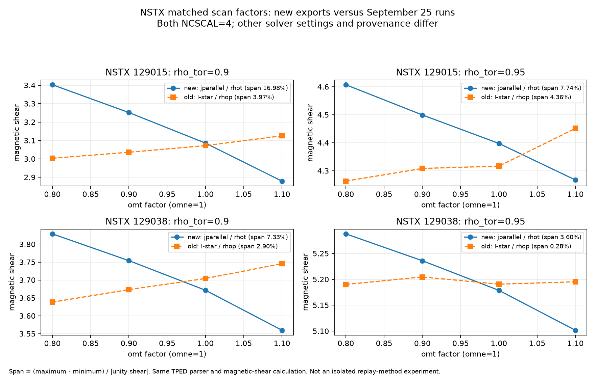

# DIII-D and NSTX exported CHEASE-BS comparison - 2026-09-28

Replotted **323 saved cases in 27 campaigns** with TPED's `compare_cheasebs_runs.py`: full diagnostic figures, pedestal zooms, pressure-chain plots, and compact q/shear views. The 27 scan configs request 354 cases; 31 lack exported case metadata. Missing cases are not assigned a failure status. Source data were not changed and no new equilibria were solved.

## Main observations

- **The new NSTX scans have a clear shear response.** All 14 cases for each shot report convergence: 129015 takes 5-14 iterations, 129038 takes 6-11. This differs from the earlier NCSCAL=4 I-star scans, which usually stopped in two iterations.
- **A matched-factor comparison changes the interpretation.** For omt factors 0.8, 0.9, 1.0, 1.1 at omne=1 and rho_tor=0.9, shear spans 16.98% in new 129015 versus 3.97% previously, and 7.33% in new 129038 versus 2.90% previously. Shear decreases with omt in both new scans, while it increases in both old scans at this radius. Span means (maximum-minimum)/abs(reconstructed unity shear).
- **This is not an isolated test of NCSCAL or replay representation.** Both NSTX sets use NCSCAL=4, and source EQDSKs plus all three reference profiles are byte-identical. But the new runs use jparallel/rhot, max_iter=20, and 0.001 Ip/bootstrap/q tolerances; the older set uses I-star/rhop, max_iter=50, 0.002 Ip and 0.01 bootstrap/q tolerances, with different code/build provenance and scan implementation. Their reconstructed unity states also differ.
- **The DIII-D metadata qualify the slides' convergence wording.** For NCSCAL=4 and rhotTopPed=0.3, saved flags pass in 6/14 cases for 153764 and 14/14 for 162940 and 174082. The eight 153764 failures stop at the 12-iteration cap. In NCSCAL=1/rhotTopPed=0.3, 174082 has only six saved cases, all passing; that is not evidence that all configured cases converged.
- **Fixed-amplitude controls need separate interpretation.** Their outer Ip gate can remain unsatisfied by design. A false solver flag in those controls is not, by itself, proof that bootstrap/q iteration failed. The exports contain final scalars but no full iteration histories, so trajectory/closure claims remain limited.

[Matched NSTX figure](chease_matched/nstx_matched_old_new.png) | [Exact matched values](chease_matched/nstx_matched_old_new.json) | [Identical-source checks](nstx_source_hashes.json)



## Direct DIII-D comparisons

[153764 settings figure](DIIID153764_settings_comparison.png) | [162940 settings figure](DIIID162940_settings_comparison.png) | [174082 settings figure](DIIID174082_settings_comparison.png)

Paired checks below use only cases with passing saved flags in both campaigns, interpolated onto 181 common rho_tor points over 0.8-0.98. Differences are maxima over those radii and matched cases. A visually similar q profile need not have identical shear; the outer shear comparison is especially sensitive to differentiation and resolution. These are output comparisons, not numerical-error bounds.

| Shot | Comparison | Matched passing cases | Max q difference | Max absolute shear difference |
|---|---|---:|---:|---:|
| DIIID153764 | NCSCAL 1 vs 4, top=0.8 | 11 | 0.747% | 0.503 |
| DIIID153764 | top=0.8 vs 0.3, NCSCAL=4 | 6 | 0.450% | 0.091 |
| DIIID162940 | NCSCAL 1 vs 4, top=0.8 | 8 | 1.183% | 0.626 |
| DIIID162940 | top=0.8 vs 0.3, NCSCAL=4 | 11 | 2.136% | 0.568 |
| DIIID174082 | NCSCAL 1 vs 4, top=0.8 | 12 | 1.700% | 0.963 |
| DIIID174082 | top=0.8 vs 0.3, NCSCAL=4 | 13 | 2.347% | 1.195 |

[Case-by-case paired checks](diiid_matched_checks.json).

## Plot index and coverage

Every campaign links to a compact q/shear figure and the original TPED diagnostic layout. Each also has `plot.log`. Failed saved flags are identified in diagnostic legends and dashed in compact/settings figures. Campaigns remain separate to avoid mixing constraints. Pressure-chain plots show paired omt/omne scans as scatter points, without a misleading one-parameter connecting line or fitted slope.

The full diagnostics retain TPED's delta-panel rho_tor<=0.95 cap. Absolute shear and pressure-chain samples extend farther out; those outer values need grid/derivative checks before physics interpretation. Pressure-chain x axes are solved/source pressure, not solved/requested pressure error. Compact q/shear plots call the same TPED parser and shear helper as the diagnostics.

| Shot | Campaign | NCSCAL | top | Saved / configured | Passing flags | Iterations | Plots |
|---|---|---:|---:|---:|---:|---|---|
| DIIID153764 | chease | 1 | 0.8 | 14/14 | 11 | 2-12 | [q/shear](DIIID153764/chease/q_shear.png) / [full](DIIID153764/chease/cheasebs_comparison_153764_om.png) / [zoom](DIIID153764/chease/cheasebs_comparison_153764_om_rho0.8-0.98.png) / [pressure](DIIID153764/chease/cheasebs_comparison_153764_om_pchain.png) |
| DIIID153764 | chease_fixedamp | 1 | 0.8 | 14/14 | 1 | 2-12 | [q/shear](DIIID153764/chease_fixedamp/q_shear.png) / [full](DIIID153764/chease_fixedamp/cheasebs_comparison_153764_om.png) / [zoom](DIIID153764/chease_fixedamp/cheasebs_comparison_153764_om_rho0.8-0.98.png) / [pressure](DIIID153764/chease_fixedamp/cheasebs_comparison_153764_om_pchain.png) |
| DIIID153764 | chease_ncscal4 | 4 | 0.8 | 14/14 | 14 | 2-11 | [q/shear](DIIID153764/chease_ncscal4/q_shear.png) / [full](DIIID153764/chease_ncscal4/cheasebs_comparison_153764_om.png) / [zoom](DIIID153764/chease_ncscal4/cheasebs_comparison_153764_om_rho0.8-0.98.png) / [pressure](DIIID153764/chease_ncscal4/cheasebs_comparison_153764_om_pchain.png) |
| DIIID153764 | chease_rhotTopPed0p3 | 1 | 0.3 | 14/14 | 5 | 2-12 | [q/shear](DIIID153764/chease_rhotTopPed0p3/q_shear.png) / [full](DIIID153764/chease_rhotTopPed0p3/cheasebs_comparison_153764_om.png) / [zoom](DIIID153764/chease_rhotTopPed0p3/cheasebs_comparison_153764_om_rho0.8-0.98.png) / [pressure](DIIID153764/chease_rhotTopPed0p3/cheasebs_comparison_153764_om_pchain.png) |
| DIIID153764 | chease_rhotTopPed0p3_fixedamp | 1 | 0.3 | 14/14 | 1 | 2-12 | [q/shear](DIIID153764/chease_rhotTopPed0p3_fixedamp/q_shear.png) / [full](DIIID153764/chease_rhotTopPed0p3_fixedamp/cheasebs_comparison_153764_om.png) / [zoom](DIIID153764/chease_rhotTopPed0p3_fixedamp/cheasebs_comparison_153764_om_rho0.8-0.98.png) / [pressure](DIIID153764/chease_rhotTopPed0p3_fixedamp/cheasebs_comparison_153764_om_pchain.png) |
| DIIID153764 | chease_rhotTopPed0p3_fixedamp_ncscal4 | 4 | 0.3 | 14/14 | 1 | 2-12 | [q/shear](DIIID153764/chease_rhotTopPed0p3_fixedamp_ncscal4/q_shear.png) / [full](DIIID153764/chease_rhotTopPed0p3_fixedamp_ncscal4/cheasebs_comparison_153764_om.png) / [zoom](DIIID153764/chease_rhotTopPed0p3_fixedamp_ncscal4/cheasebs_comparison_153764_om_rho0.8-0.98.png) / [pressure](DIIID153764/chease_rhotTopPed0p3_fixedamp_ncscal4/cheasebs_comparison_153764_om_pchain.png) |
| DIIID153764 | chease_rhotTopPed0p3_ncscal4 | 4 | 0.3 | 14/14 | 6 | 2-12 | [q/shear](DIIID153764/chease_rhotTopPed0p3_ncscal4/q_shear.png) / [full](DIIID153764/chease_rhotTopPed0p3_ncscal4/cheasebs_comparison_153764_om.png) / [zoom](DIIID153764/chease_rhotTopPed0p3_ncscal4/cheasebs_comparison_153764_om_rho0.8-0.98.png) / [pressure](DIIID153764/chease_rhotTopPed0p3_ncscal4/cheasebs_comparison_153764_om_pchain.png) |
| DIIID162940 | chease | 1 | 0.8 | 14/14 | 10 | 2-12 | [q/shear](DIIID162940/chease/q_shear.png) / [full](DIIID162940/chease/cheasebs_comparison_162940_om.png) / [zoom](DIIID162940/chease/cheasebs_comparison_162940_om_rho0.8-0.98.png) / [pressure](DIIID162940/chease/cheasebs_comparison_162940_om_pchain.png) |
| DIIID162940 | chease_fixedamp | 1 | 0.8 | 14/14 | 2 | 2-12 | [q/shear](DIIID162940/chease_fixedamp/q_shear.png) / [full](DIIID162940/chease_fixedamp/cheasebs_comparison_162940_om.png) / [zoom](DIIID162940/chease_fixedamp/cheasebs_comparison_162940_om_rho0.8-0.98.png) / [pressure](DIIID162940/chease_fixedamp/cheasebs_comparison_162940_om_pchain.png) |
| DIIID162940 | chease_ncscal4 | 4 | 0.8 | 14/14 | 11 | 2-12 | [q/shear](DIIID162940/chease_ncscal4/q_shear.png) / [full](DIIID162940/chease_ncscal4/cheasebs_comparison_162940_om.png) / [zoom](DIIID162940/chease_ncscal4/cheasebs_comparison_162940_om_rho0.8-0.98.png) / [pressure](DIIID162940/chease_ncscal4/cheasebs_comparison_162940_om_pchain.png) |
| DIIID162940 | chease_rhotTopPed0p3 | 1 | 0.3 | 14/14 | 14 | 2-19 | [q/shear](DIIID162940/chease_rhotTopPed0p3/q_shear.png) / [full](DIIID162940/chease_rhotTopPed0p3/cheasebs_comparison_162940_om.png) / [zoom](DIIID162940/chease_rhotTopPed0p3/cheasebs_comparison_162940_om_rho0.8-0.98.png) / [pressure](DIIID162940/chease_rhotTopPed0p3/cheasebs_comparison_162940_om_pchain.png) |
| DIIID162940 | chease_rhotTopPed0p3_fixedamp | 1 | 0.3 | 14/14 | 1 | 2-20 | [q/shear](DIIID162940/chease_rhotTopPed0p3_fixedamp/q_shear.png) / [full](DIIID162940/chease_rhotTopPed0p3_fixedamp/cheasebs_comparison_162940_om.png) / [zoom](DIIID162940/chease_rhotTopPed0p3_fixedamp/cheasebs_comparison_162940_om_rho0.8-0.98.png) / [pressure](DIIID162940/chease_rhotTopPed0p3_fixedamp/cheasebs_comparison_162940_om_pchain.png) |
| DIIID162940 | chease_rhotTopPed0p3_fixedamp_ncscal4 | 4 | 0.3 | 14/14 | 1 | 2-20 | [q/shear](DIIID162940/chease_rhotTopPed0p3_fixedamp_ncscal4/q_shear.png) / [full](DIIID162940/chease_rhotTopPed0p3_fixedamp_ncscal4/cheasebs_comparison_162940_om.png) / [zoom](DIIID162940/chease_rhotTopPed0p3_fixedamp_ncscal4/cheasebs_comparison_162940_om_rho0.8-0.98.png) / [pressure](DIIID162940/chease_rhotTopPed0p3_fixedamp_ncscal4/cheasebs_comparison_162940_om_pchain.png) |
| DIIID162940 | chease_rhotTopPed0p3_ncscal4 | 4 | 0.3 | 14/14 | 14 | 2-17 | [q/shear](DIIID162940/chease_rhotTopPed0p3_ncscal4/q_shear.png) / [full](DIIID162940/chease_rhotTopPed0p3_ncscal4/cheasebs_comparison_162940_om.png) / [zoom](DIIID162940/chease_rhotTopPed0p3_ncscal4/cheasebs_comparison_162940_om_rho0.8-0.98.png) / [pressure](DIIID162940/chease_rhotTopPed0p3_ncscal4/cheasebs_comparison_162940_om_pchain.png) |
| DIIID174082 | chease | 1 | 0.8 | 14/14 | 13 | 4-16 | [q/shear](DIIID174082/chease/q_shear.png) / [full](DIIID174082/chease/cheasebs_comparison_174082_om.png) / [zoom](DIIID174082/chease/cheasebs_comparison_174082_om_rho0.8-0.98.png) / [pressure](DIIID174082/chease/cheasebs_comparison_174082_om_pchain.png) |
| DIIID174082 | chease_fixedamp | 1 | 0.8 | 14/14 | 0 | 16-16 | [q/shear](DIIID174082/chease_fixedamp/q_shear.png) / [full](DIIID174082/chease_fixedamp/cheasebs_comparison_174082_om.png) / [zoom](DIIID174082/chease_fixedamp/cheasebs_comparison_174082_om_rho0.8-0.98.png) / [pressure](DIIID174082/chease_fixedamp/cheasebs_comparison_174082_om_pchain.png) |
| DIIID174082 | chease_ncscal4 | 4 | 0.8 | 14/14 | 13 | 4-16 | [q/shear](DIIID174082/chease_ncscal4/q_shear.png) / [full](DIIID174082/chease_ncscal4/cheasebs_comparison_174082_om.png) / [zoom](DIIID174082/chease_ncscal4/cheasebs_comparison_174082_om_rho0.8-0.98.png) / [pressure](DIIID174082/chease_ncscal4/cheasebs_comparison_174082_om_pchain.png) |
| DIIID174082 | chease_rhotTopPed0p3 | 1 | 0.3 | 6/14 | 6 | 4-16 | [q/shear](DIIID174082/chease_rhotTopPed0p3/q_shear.png) / [full](DIIID174082/chease_rhotTopPed0p3/cheasebs_comparison_174082_om.png) / [zoom](DIIID174082/chease_rhotTopPed0p3/cheasebs_comparison_174082_om_rho0.8-0.98.png) / [pressure](DIIID174082/chease_rhotTopPed0p3/cheasebs_comparison_174082_om_pchain.png) |
| DIIID174082 | chease_rhotTopPed0p3_fixedamp | 1 | 0.3 | 6/14 | 0 | 20-20 | [q/shear](DIIID174082/chease_rhotTopPed0p3_fixedamp/q_shear.png) / [full](DIIID174082/chease_rhotTopPed0p3_fixedamp/cheasebs_comparison_174082_om.png) / [zoom](DIIID174082/chease_rhotTopPed0p3_fixedamp/cheasebs_comparison_174082_om_rho0.8-0.98.png) / [pressure](DIIID174082/chease_rhotTopPed0p3_fixedamp/cheasebs_comparison_174082_om_pchain.png) |
| DIIID174082 | chease_rhotTopPed0p3_fixedamp_ncscal4 | 4 | 0.3 | 14/14 | 0 | 20-20 | [q/shear](DIIID174082/chease_rhotTopPed0p3_fixedamp_ncscal4/q_shear.png) / [full](DIIID174082/chease_rhotTopPed0p3_fixedamp_ncscal4/cheasebs_comparison_174082_om.png) / [zoom](DIIID174082/chease_rhotTopPed0p3_fixedamp_ncscal4/cheasebs_comparison_174082_om_rho0.8-0.98.png) / [pressure](DIIID174082/chease_rhotTopPed0p3_fixedamp_ncscal4/cheasebs_comparison_174082_om_pchain.png) |
| DIIID174082 | chease_rhotTopPed0p3_fixedamp_ramp | 1 | 0.3 | 7/14 | 0 | 20-20 | [q/shear](DIIID174082/chease_rhotTopPed0p3_fixedamp_ramp/q_shear.png) / [full](DIIID174082/chease_rhotTopPed0p3_fixedamp_ramp/cheasebs_comparison_174082_om.png) / [zoom](DIIID174082/chease_rhotTopPed0p3_fixedamp_ramp/cheasebs_comparison_174082_om_rho0.8-0.98.png) / [pressure](DIIID174082/chease_rhotTopPed0p3_fixedamp_ramp/cheasebs_comparison_174082_om_pchain.png) |
| DIIID174082 | chease_rhotTopPed0p3_fixedamp_relax0p3 | 1 | 0.3 | 6/14 | 0 | 20-20 | [q/shear](DIIID174082/chease_rhotTopPed0p3_fixedamp_relax0p3/q_shear.png) / [full](DIIID174082/chease_rhotTopPed0p3_fixedamp_relax0p3/cheasebs_comparison_174082_om.png) / [zoom](DIIID174082/chease_rhotTopPed0p3_fixedamp_relax0p3/cheasebs_comparison_174082_om_rho0.8-0.98.png) / [pressure](DIIID174082/chease_rhotTopPed0p3_fixedamp_relax0p3/cheasebs_comparison_174082_om_pchain.png) |
| DIIID174082 | chease_rhotTopPed0p3_ncscal4 | 4 | 0.3 | 14/14 | 14 | 4-20 | [q/shear](DIIID174082/chease_rhotTopPed0p3_ncscal4/q_shear.png) / [full](DIIID174082/chease_rhotTopPed0p3_ncscal4/cheasebs_comparison_174082_om.png) / [zoom](DIIID174082/chease_rhotTopPed0p3_ncscal4/cheasebs_comparison_174082_om_rho0.8-0.98.png) / [pressure](DIIID174082/chease_rhotTopPed0p3_ncscal4/cheasebs_comparison_174082_om_pchain.png) |
| DIIID174082 | ncscal_default_check | 1 | 0.3 | 2/2 | 2 | 4-17 | [q/shear](DIIID174082/ncscal_default_check/q_shear.png) / [full](DIIID174082/ncscal_default_check/cheasebs_comparison_174082_om.png) / [zoom](DIIID174082/ncscal_default_check/cheasebs_comparison_174082_om_rho0.8-0.98.png) / [pressure](DIIID174082/ncscal_default_check/cheasebs_comparison_174082_om_pchain.png) |
| DIIID174082 | two_template_check | 4 | 0.3 | 2/2 | 2 | 4-17 | [q/shear](DIIID174082/two_template_check/q_shear.png) / [full](DIIID174082/two_template_check/cheasebs_comparison_174082_om.png) / [zoom](DIIID174082/two_template_check/cheasebs_comparison_174082_om_rho0.8-0.98.png) / [pressure](DIIID174082/two_template_check/cheasebs_comparison_174082_om_pchain.png) |
| NSTX129015 | variations | 4 | 0.8 | 14/14 | 14 | 5-14 | [q/shear](NSTX129015/variations/q_shear.png) / [full](NSTX129015/variations/cheasebs_comparison_129015_om.png) / [zoom](NSTX129015/variations/cheasebs_comparison_129015_om_rho0.8-0.98.png) / [pressure](NSTX129015/variations/cheasebs_comparison_129015_om_pchain.png) |
| NSTX129038 | variations | 4 | 0.8 | 14/14 | 14 | 6-11 | [q/shear](NSTX129038/variations/q_shear.png) / [full](NSTX129038/variations/cheasebs_comparison_129038_om.png) / [zoom](NSTX129038/variations/cheasebs_comparison_129038_om_rho0.8-0.98.png) / [pressure](NSTX129038/variations/cheasebs_comparison_129038_om_pchain.png) |

TPED implementation: [b5170e7](https://github.com/drdrhatch/TPED/commit/b5170e7) on `gene_datatree`.

## Reproduce / use different paths

Run from the TPED checkout (PowerShell example):

```powershell
.\.venv\Scripts\python.exe projects/discharge_tools/scripts/compare_cheasebs_runs.py `
  --baseline C:/Users/joesc/git/cheaseBS_tests/data/lleppin_NSTX_chease_tests/NSTX129015 `
  --variations C:/Users/joesc/git/cheaseBS_tests/data/lleppin_NSTX_chease_tests/NSTX129015/variations `
  --outdir C:/Users/joesc/git/cheaseBS_tests/reports/nstx129015-comparison `
  --pedestal 0.8,0.98 --slices 0.85 0.9 0.95 0.975
```

- `--baseline DIR`: directory containing the source gfile and unmodified `profiles_*` or `REF_profiles_*`. Use the shot directory, not the exported `variations/baseline` folder, which contains metadata and a preview but no source EQDSK.
- `--baseline-gfile FILE`: select an explicit baseline EQDSK when needed; reference profiles come from `--baseline` or the file's parent. This also allows an explicitly chosen reconstructed reference. Label that reference accordingly when presenting the result.
- `--variations DIR ...`: campaign roots or explicit run directories. Existing positional paths still work. Use one shot per explicit baseline.
- `--slices RHO ...`: pressure-chain radii without alpha contouring. Existing `--chapman` and `--alpha` remain supported; an explicit baseline controls Chapman fitting too.
- Metadata resolves relocated output/profile basenames and supplies settings, transform labels and final summaries. No synthetic iteration histories are constructed. Namelist NCSCAL is read locally where not explicitly overridden in metadata.
- DIII-D 174082 exposed a pre-existing GFileData validation bug: the identifier before the dimensions was required to be 3. Its valid source uses 0. Validation and dimension parsing now accept other integer identifiers and both 15/16-character fields; 174082 itself parses as width 16.

All 15 focused regression tests passed, including legacy layouts, both profile naming conventions, explicit overrides, wrong-shot/ambiguous baseline rejection, final summaries without traces, and EFIT header variants.

[Commands used](commands.json) | [Case CSV](case_values.csv) | [Case JSON](case_values.json) | [Campaign summaries](campaign_summary.json) | [Generator](generate_report.py)

Regenerate the campaign plots with the same Python environment:

```powershell
python generate_report.py --data-root C:/Users/joesc/git/cheaseBS_tests/data --tped C:/Users/joesc/git/TPED --outdir . --resume
```

Omit `--resume` to rebuild every campaign. `matched_chease_comparison.py` writes the older/new NSTX comparison into `chease_matched/`. `finish_report.py` rebuilds paired checks, settings figures and this index for this dated dataset.
